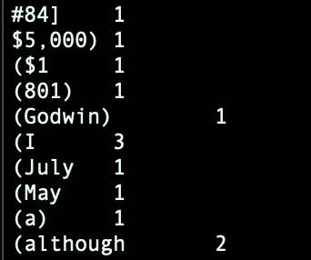

# W3 HW

Nick Brooks

## Getting Hadoop Running in Docker

Getting Hadoop running on Docker on your local machine sounds easy at first, but actually is quite the process. This guide will show you step-by-step how I was able to get everything configured and up and running on my local machine.

These steps were done on a macOS 14.4 with an m1 chip, so results and steps may vary if on another OS or chip.

### 1. Initial Setup : Creating Directories

On your local machine, create a directory in the location that you want to run Docker Hadoop from and enter that folder. 

Open a terminal and enter:

```bash
mkdir running-hadoop
cd running-hadoop
```

### 2. Clone the Docker-Hadoop repository

For this step, we are going to be cloning the docker-hadoop repository from big-data-europe into our running-hadoop folder (or whatever you named it; I will be referring to this folder as running-hadoop from now). 

We will create a new folder within running-hadoop called eu. 

```bash
mkdir eu
cd eu
```

Now, we will clone docker-hadoop to this eu folder. 

```bash
git clone https://github.com/big-data-europe/docker-hadoop.git

cd docker-hadoop
```

### 3. Ensure that docker is running on your machine

Simple step, but in order to use hadoop in docker, docker must be running on your machine. Shocking, I know.

```bash
docker run hello-world
```

Assuming that docker is running, you should eventually see the Hello from Docker! message. If you don’t see this message, start running Docker.

### 4. Bring up the hadoop containers

Now, we can start getting into the nitty gritty. We will first need to get the hadoop containers up and running on the machine. 

To do so, enter the following (you should still be in the docker-hadoop folder!): 

```bash
docker-compose up -d
```

This will take a minute or two to complete.

To ensure that everything succeeded and is working as expected, run the following command:

```bash
docker ps
```


You should see 5 different images running on your machine: namenode, resourcemanager, datanode, historyserver, and nodemanager.

### 5. Enter namenode

Now that everything is up and running on your system, we will enter namenode, which is where the majority of the hadoop work is done.

```bash
docker exec -it namenode /bin/bash
```

This will take you to within the namenode. In order to double check and make sure that everything is working as expected, a quick test is to enter the following:

```bash
echo hello world
```

If you see ‘hello world’ printed out, you are all set!

### 6. Create a filesystem for your container

Now that we are in namenode, we need to set up our file system.

```bash
mkdir app
cd app
mkdir data
mkdir jars
mkdir res
```

### 7. Add data to the filesystem

In order to run WordCount.jar (we’ll get to that in a bit), we need to have some files to test with. For this, we grabbed some e-books from the Gutenberg project.

```bash
cd data
curl https://www.gutenberg.org/cache/epub/1342/pg1342.txt -o austen.txt
curl https://www.gutenberg.org/cache/epub/84/pg84.txt -o shelley.txt
curl https://www.gutenberg.org/cache/epub/768/pg768.txt -o bronte.txt
```

This will download the books as text files that we can use in our analysis. If you want to double check and make sure the books actually downloaded, you can enter:

```bash
ls -al
```


You can then see and make sure that the files are not empty (read: are not 0 bytes). Assuming everything succeeded, we can move on to our next step: getting WordCount.jar

### 8. Getting WordCount.jar

There are different ways of going about this, but the following steps are what worked for me.

1. Go to [https://github.com/wxw-matt/docker-hadoop/blob/master/jobs/jars/WordCount.jar](https://github.com/wxw-matt/docker-hadoop/blob/master/jobs/jars/WordCount.jar) and download the WordCount.jar file
2. Open a second terminal window and cd into the Downloads folder (or wherever you placed WordCount.jar)
3. In the terminal, enter the following:

```bash
docker cp WordCount.jar namenode:/app/jars/WordCount.jar
```

This should then copy the WordCount.jar file into the jars folder in namenode.

To double check and make sure that the file got correctly copied, go back to your first terminal window (or reenter namenode ala Step 5) and cd into the /jars/ directory

```bash
cd /app/jars
ls
```

Running these commands should show you the WordCount.jar file. Now we can start using Hadoop Docker! Yay!

### 9. Move the test files into Hadoop

In order to read/write to files, Hadoop must have files in their internal data structure. So let’s move our items to the correct locations.

```bash
cd /
hdfs dfs -mkdir /test-1-input
hdfs dfs -copyFromLocal -f /app/data/*.txt /test-1-input/
```

The * should be replaced with one of the text files that you downloaded in your data folder, e.g. bronte.txt or shelley.txt.

These lines will

1. create a directory in Hadoop’s internal file structure
2. copy the text file into the new directory so Hadoop can access it

Now that Hadoop has the file it needs, we can run the test!

### 10. Running WordCount.jar

Now we can run our test.

```bash
hadoop jar /app/jars/WordCount.jar WordCount /test-1-input /test-1-output
```

This line will take the WordCount.jar file and run it against the text file that was placed into /test-1-input/ directory, and will write the results to the /test-1-output/ directory.

This step can take a minute to complete.

### 11. Seeing our results

Now that the test has been run, we can look at our results. We must first copy the /test-1-output/ directory to our namenode directory so we can access the file. We can do so with:

```bash
hdfs dfs -copyToLocal /test-1-output /app/res/
```

Now that we can access our file, we just need to look at the results to make sure everything worked!

```bash
head /app/res/test-1-output/part-r-00000
```

This will display the results of the output file. If everything went according to plan, you should see results that resemble:



If your results appear similarly, with words and counts next to them, congratulations! You have successfully run Hadoop in Docker! This is a momentous occasion that calls for celebration, you earned it! 👏
